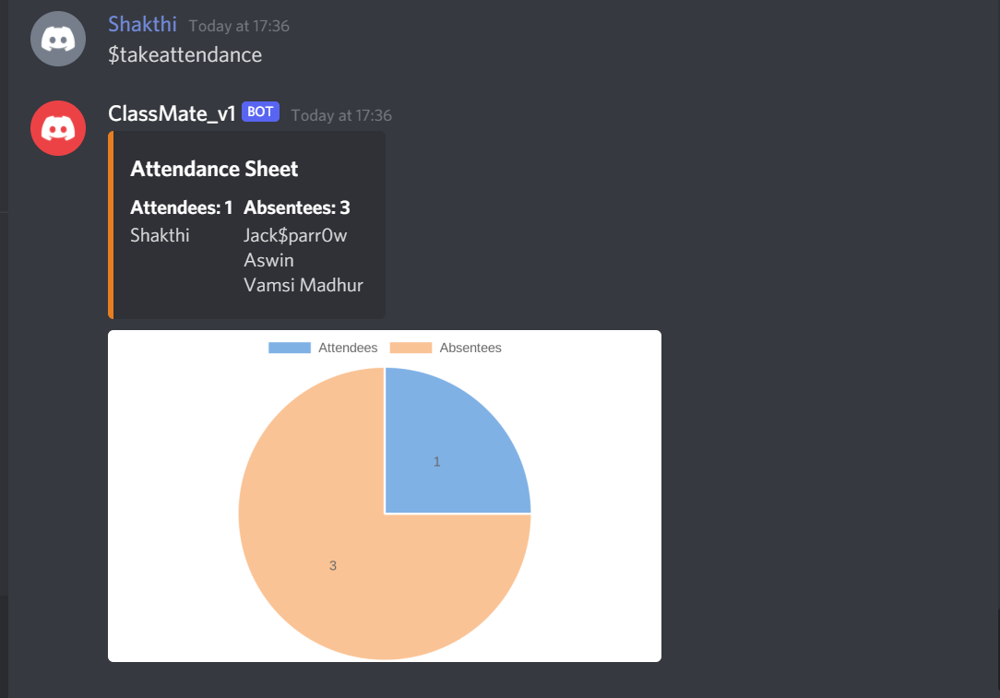

# About $takeattendance
This command lets instructors calculate attendance. 

It shows the attendees and absentees list.
It also shows a chart with percentage of people present and absent.

# Location of Code
The code that implements the above mentioned functionality is located [here](https://github.com/Ashwinshankar98/ClassMateBot/blob/main/cogs/cal_attendance.py)

# Code Description
## Functions

1. def takeattendance(self, ctx): 

This function calculates attendance and shows the list of attendees and absentees. 
   

# How to run it? (Small Example)
Enter the command only in the Instructor channel:  "$takeattendance"
```
$takeattendance 
```
Successful execution will show the attendees and absentees list with a distribution chart. 


